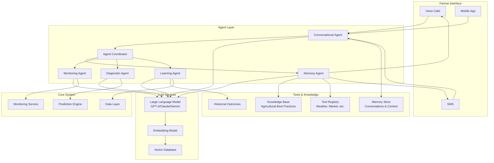

```mermaid
graph TB
    subgraph Farmer Interface
        VOICE[Voice Calls]
        SMS[SMS]
        APP[Mobile App]
    end
    
    subgraph Agent Layer
        CA[Conversational Agent]
        AA[Advisory Agent]
        MA[Monitoring Agent]
        DA[Diagnostic Agent]
        LA[Learning Agent]
        COORD[Agent Coordinator]
    end
    
    subgraph LLM Services
        LLM[Large Language Model<br/>GPT-4/Claude/Gemini]
        EMB[Embedding Model]
        VEC[Vector Database]
    end
    
    subgraph Tools & Knowledge
        KB[Knowledge Base<br/>Agricultural Best Practices]
        TOOLS[Tool Registry<br/>Weather, Market, etc.]
        MEM[Memory Store<br/>Conversations & Context]
        HIST[Historical Outcomes]
    end
    
    subgraph Core System
        PRED[Prediction Engine]
        MON[Monitoring Service]
        DATA[Data Layer]
    end
    
    VOICE --> CA
    SMS --> CA
    APP --> CA
    
    CA --> COORD
    COORD --> AA
    COORD --> MA
    COORD --> DA
    COORD --> LA
    
    AA --> LLM
    MA --> LLM
    DA --> LLM
    LA --> LLM
    CA --> LLM
    
    LLM --> EMB
    EMB --> VEC
    
    AA --> KB
    AA --> TOOLS
    CA --> MEM
    LA --> HIST
    
    MA --> MON
    DA --> PRED
    LA --> DATA
    
    AA --> VOICE
    AA --> SMS
```
